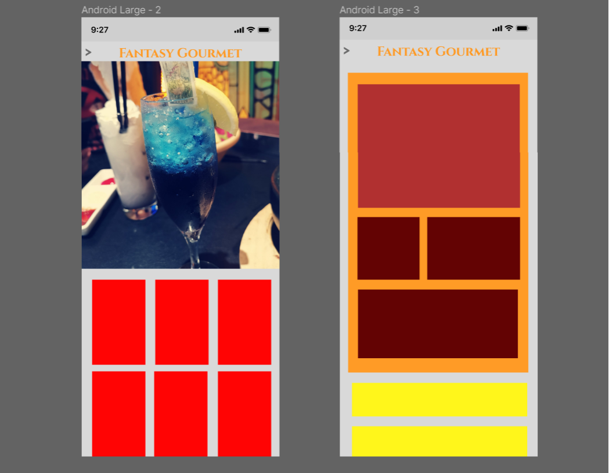

# FANTASY GOURMETS
  
Table of Contents

  <ol>
    <li>
      <a href="#about-the-project">About the Project</a>
      <ul>
        <li><a href="#goals">Goals</a></li>
        <li><a href="#target-audience">Target audience</a></li>
      </ul>
    </li>
    <li>
    <a href="#ui-and-ux">UI and UX</a>
    <ul>
        <li><a href="#design">Design</a></li>
        <li><a href="#wireframe">Wireframe</a></li>
    </ul>
    </li>
        <li>
        <a href="#features">Features</a>
        <ul>
        <li><a href="#wireframe">Wireframe</a></li>
        <li><a href="#limitations">Limitations</a></li>
        </ul>
        </li>
        <li><a href="#built-with">Built With</a></li>
        <li><a href="#testing">Testing</a></li>
  </ol>

## About the Project
Being an avid fan of the gaming and food, i often find myself searching for cooking recipe online that is inspired by fantasy with origin from film or game. However, it takes more time to search for the recipe than it takes to study it.  

This website will benefit people with similar interest as me by giving them a one stop site to meet like-minded people to post, search and review recipes that they have.

The demo of the live website can be accessed here:
[Fantasy Gourmet](https://fantasygourmet.netlify.app/)

(<a href="#healthmax"> Back to top </a>)

## Goals 
### Organization's goals
 In this age of technology, people should not spend ages online just to find some thing that they want. This site will provide an ease-of-access to users and spark progression in the community

### User's goals
Our target audience seeks self-improvement in their art and increase their repertoire. Recipe of "Fantasy food" is often hard find for someone without much background in culinary.

Below are some user stories:
| User Stories | Accceptance Criteria |
| ----------- | ----------- |
| A host that want to theme up their weekly games' night | User can search for simple recipe all from films or games |
| User that want to find if there are recipe for food they saw in a film or gmae | A dropdown list is avaliable for user to further narrow down their search to a film or game eg. FF14, LoTR, etc.|
| After using the recipe they want to leave comments and improvement that can be made | Website allow user to leave reviews on all the different recipes.|
| For more veteran community members, they wish to share the infomation that they have with the rest of the community | User can post, edit and delete their own post in this forum.|

(<a href="#healthmax"> Back to top </a>)

## Target audience
Our target audience:
* *People they want to theme up their games' night*
* *Seasonal cooks that want to host a event*
* *Veteran community member to share their knowledge*

We are also targeting community member that are **Active**. To spark discussion and improve of the whole community. 

(<a href="#healthmax"> Back to top </a>)

## UI and UX
The aim of the this application is to create a simple and easy to use and understand layout with image and words from the site to be the main actors. Forming a theme and developing a wireframe.

## Design
### Colors

We decided to use an array of colors that is homely and give a vibe of being in an old tavern. Themeing like so not only do they make otherwise flat and solid colors more vibrant and exciting.

As for the fonts, we want it to be more fantasy-like(Cinzel). However being a text heavy site having another font (Lustria) for ease of reading will help alot.

(<a href="#healthmax"> Back to top </a>)

## Wireframe

The deployed site have gone through multiple iterations and improvements. Many changes have been made compared to the alpha version of the application. 

### Changes
1. Application have unified theme
2. There is a different landing page
3. Login page have been changed from a page to small offcanvas
4. Added a dropdown list to narrow down the search result
5. Added 2 buttons to the search bar for additional service of the application (Filter and Reset).

(<a href="#healthmax"> Back to top </a>)

## Features

On the landing page, the user will be greeted with randomly generated motivational quote before proceeding to the map. There will also be a loading bar for user's with slower internet ( Shown above on the tablet device )

| Features | Status | Description |
| --- | --- | ---- |
| View Recipe | DONE | User can find all the recipe that have been postedto the site|
| Filtering Search | DONE | Search for food recipe based on what the user wants eg. Name, Cost, Origin of recipe. |
| Login | DONE | Being a forum, website allow user to create and login. |
| Post recipes and reviews | DONE | After logging in, the user can Create, Read, Edit and Delete recipes and reviews of recipes |
| Post new origin of recipe | NOT IMPLEMENTED | Upload more films or games. |
| Sharing to social media site | NOT IMPLEMENTED | Allow user to share recipe to other social site. |

(<a href="#healthmax"> Back to top </a>)

## Limitations
1. Collection of data
    * Being a forum for a budding community, the amount of data is based on user's input.
  

2. Quality of data 
    * Data presented might be offensive to some users, without a proper team, vetting the information might be hard.
  

(<a href="#healthmax"> Back to top </a>)

## Built With
* [Visual Studio Code](https://code.visualstudio.com/) ( HTML, CSS, Javascript )
    - A free and easy to use coding programme for beginners
  

* [React](https://reactjs.org/)
    - Well written documentation and multiple videos tutorials regarding its use.
    - Multi easy to use add-ons
  

* [Express](https://expressjs.com/)
    -  Designing and Building web applications quickly and easily
  

* [MongoDB](https://www.mongodb.com/home)
    -  Designed to make data easy to access, and rarely to require joins or transactions.
    - MongoDB is a NoSQL database management application.
  

* [Axios](https://axios-http.com/docs/intro)
    - Ability to intercept HTTP requests. 
  

* [Bootstrap 5](https://getbootstrap.com/) & [Bootstrap-icon](https://icons.getbootstrap.com/) 
    - Designed to enable responsive development of mobile-first websites
  

* [LottieFiles](https://lottiefiles.com/)
    - Easy way to make web pages more dynamic and engaging with animations
  

* [ReactToastify](https://www.npmjs.com/package/react-toastify)
    - Enable creation beautiful and interactive visualizations of data
  

* [CLIP STUDIO PAINT](https://www.clipstudio.net/)
    - Selections of varying feature create by the software and users that is used for image editing.
  

(<a href="#healthmax"> Back to top </a>)

## Testing
### Test Account
* username: tes2@gmail.com
* paswword: asdasdasd
  

Show Test Cases

|Test Case|Steps|Results|
|---|---|---|
|Loading of Webpage|<ol><li>Go to [Fantasy Gourmet](https://fantasygourmet.netlify.app/)</li></ol>|<ol><li>The website should load without issue</li></ol>|
|Create an Account|<ol><li>Land on the website landing page</li><li>Click on the person icon on the top right of the site</li><li>Click create tab after a popup appear</li><li>Fill in the information and click create</li></ol>|<ol><li>Landing page will show a Nav bar and an image in the center</li><li>After click the human icon on the top, a popup will appear</li><li>Clicking the create tab will show a form.</li><li>A popup will inform user that account is created.</li></ol>|
|Logging in|<ol><li>Click the person icon on the navbar top right</li><li>Fill in account info and click login</li></ol>|<ol><li>A popup will appear showing the login form</li><li>The popup will disappear and a new popup will appear informing the user that the login is a success</li></ol>|
|Post recipe|<ol><li>User need to login 1st, click the top right list icon so show more info</li><li>Click on the "POST RECIPE" link</li><li>Fill in the infomation in the form and click submit.</li></ol>|<ol><li>After login user will see the home page</li><li>A popup will appear on the right showing a few links</li><li>A form will appear to allow user to post their recipe's infomations</li><li>A popup will appear to inform user that the recipe is created</li></ol>|
|View all Recipe|<ol><li>Click on the view recipe at home page or from the popup of the navbar</li><li>Wait for page to load</li></ol>|<ol><li>A loading display will appear</li><li>All recipe will be shown as cards</li></ol>|
|Filter Recipe|<ol><li>After getting to view recipe page, click on the filter search button</li><li>Fill in the details user want the search to be</li><li>Click on the search/filter button</li></ol>|<ol><li>A popup will appear showing a form</li><li>The filter pop up will disappear</li><li>Recipe shown will be only wat the user searched for</li></ol>|
|Show detailed info of a recipe|<ol><li>Get to the view all recipe page</li><li>Click on any recipe card</li></ol>|<ol><li>Mousing over the card will expand</li><li>After clicking the page will change to that of a detailed page of the selected recipe</li></ol>|
|Edit Recipe|<ol><li>User need to login to edit their own recipe</li><li>After logging it, click on their recipe they want to edit</li><li>Click on the edit button on the top of the detailed page</li><li>Edit the form</li><li>Click submit</li></ol>|<ol><li>After logging and going to detailed recipe page, user will see edit button if they are the one created it</li><li>A form will appear for the user to edit the recipe</li><li>After submit, there will be a popup to inform user that edit is a success</li></ol>|
|Delete a recipe|<ol><li>Similar step as to edit</li><li>Instead of click the edit button click the delete button</li></ol>|<ol><li>At the detailed page, the delete button will appear</li><li>A popup will appear informing user the delete is a success</li></ol>|
|Logging out|<ol><li>Click on the person icon on the right of the nav bar</li><li>Click logout on the popup</li></ol>|<ol><li>A popup will appear with the logout button</li><li>A pop up will appear after clicking logout to inform user they logged out</li></ol>|
|Posting a review|<ol><li>Login to an account</li><li>Go to any recipe's detailed page</li><li>Scroll down to the bottom of the page</li><li>Fill in the form for posting</li><li>Click the post button</li></ol>|<ol><li>After logging in and going to the detailed page, user will see an empty post at the bottom</li><li>After clicking post, a popup will inform user that the post is a success</li></ol>|
|Edit and Delete a Review|<ol><li>User need to login and be on a detailed page</li><li>Scrolling down to the bottom</li><li>A edit and delete button will appear on the user's post</li><li>Clicking on the 2 buttons will allow user to edit and delete</li></ol>|<ol><li>Scrolling down from a detailed page will show all reviews</li><li>The edit and delete button will only appear on user's post</li><li>Clicking on edit will show a form for the user to edit their post</li><li>Clicking the delete or after posting, will display a popup to inform the user's success on editing or deleting</li></ol>|

(<a href="#healthmax"> Back to top </a>)
